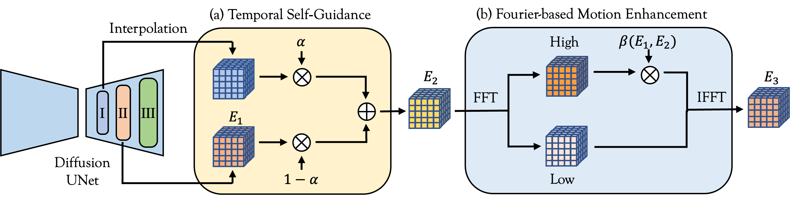

<div align="center">

<h1>BroadWay: Boost Your Text-to-Video Generation Model in a Training-free Way</h1>

<div>
    <a href="https://github.com/Bujiazi/" target="_blank">Jiazi Bu*</a><sup></sup> | 
    <a href="https://github.com/LPengYang/" target="_blank">Pengyang Ling*</a><sup></sup> | 
    <a href="https://panzhang0212.github.io/" target="_blank">Pan Zhang<sup>†</sup></a><sup></sup> | 
    <a href="https://wutong16.github.io/" target="_blank">Tong Wu</a><sup></sup> |
    <a href="https://scholar.google.com/citations?user=FscToE0AAAAJ&hl=en/" target="_blank">Xiaoyi Dong</a><sup></sup> |
    <a href="https://yuhangzang.github.io/" target="_blank">Yuhang Zang</a><sup></sup> |
    <a href="https://scholar.google.com/citations?hl=zh-CN&user=sJkqsqkAAAAJ" target="_blank">Yuhang Cao</a><sup></sup> |
    <a href="http://dahua.site/" target="_blank">Dahua Lin</a><sup></sup> |
    <a href="https://myownskyw7.github.io/" target="_blank">Jiaqi Wang<sup>†</sup></a><sup></sup>
</div>
<br>
<div>
    <sup></sup>Shanghai Jiao Tong University, University of Science and Technology of China, <br> The Chinese University of Hong Kong, Shanghai Artificial Intelligence Laboratory
</div>
(*<b>Equal Contribution</b>)(<sup>†</sup><b>Corresponding Author</b>)
<br><br>

[](https://arxiv.org/abs/2410.06241) [](https://github.com/Bujiazi/BroadWay) (project page is coming soon!)  

---

<strong>BroadWay provides a training-free and plug-and-play option to enhance the overall quality of current T2V backbones.</strong>

<div style="width: 100%; text-align: center; margin:auto;">
    
</div>
<br>


<details><summary>📖 Click for the full abstract of BroadWay</summary>

<div align="left">

> The text-to-video (T2V) generation models, offering convenient visual creation, have recently garnered increasing attention. Despite their substantial potential, the generated videos may present artifacts, including structural implausibility, temporal inconsistency, and a lack of motion, often resulting in near-static video. In this work, we have identified a correlation between the disparity of temporal attention maps across different blocks and the occurrence of temporal inconsistencies. Additionally, we have observed that the energy contained within the temporal attention maps is directly related to the magnitude of motion amplitude in the generated videos. Based on these observations, we present **BroadWay**, a training-free method to improve the quality of text-to-video generation without introducing additional parameters, augmenting memory or sampling time. Specifically, BroadWay is composed of two principal components: 1) Temporal Self-Guidance improves the structural plausibility and temporal consistency of generated videos by reducing the disparity between the temporal attention maps across various decoder blocks. 2) Fourier-based Motion Enhancement enhances the magnitude and richness of motion by amplifying the energy of the map. Extensive experiments demonstrate that BroadWay significantly improves the quality of text-to-video generation with negligible additional cost.
</details>
</div>

</div>


## 🎈Demo

<div align="center">

[![]](https://github.com/user-attachments/assets/dbaaf832-5ce4-4922-a48d-21a385cf108b)

</div>

## 🖋 News
- Code released! (10.14)
- Paper (**v1**) is available on arXiv! (10.8)

## 🏗️ Todo
- [ ] Release the project page
- [x] Release the BroadWay code
- [x] Release paper

## 💻 BroadWay Code
```python
# ---------- compute the energy of temporal attention map ----------
def compute_energy(attn_prob):
    num_frames = attn_prob.shape[-1]
    attn_prob_copy = attn_prob.reshape(2, -1, heads, num_frames, num_frames)
    energy = (attn_prob_copy[-1] ** 2).mean(dim=1).mean(dim=1).sum(dim=-1).mean(dim=0)
    return energy

# ---------- split high-frequency and low-frequency energy ----------
def split_freq(attn_prob, tau):
    num_frames = attn_prob.shape[-1]
    seq_index = num_frames // 2
    attn_prob_dft = torch.fft.fft(attn_prob, dim=-1)
    high_freq_indices = [idx for idx in range(num_frames) if seq_index - tau <=  idx  <=  seq_index + tau]
    low_freq_indices = [idx for idx in range(num_frames) if idx not in high_freq_indices]
    assert len(high_freq_indices) == 2 * tau + 1

    high_freq = attn_prob_dft[..., high_freq_indices]
    low_freq = attn_prob_dft[..., low_freq_indices]

    high_freq_abs = torch.abs(high_freq)
    low_freq_abs = torch.abs(low_freq)

    high_freq_abs = high_freq_abs.reshape(2, -1, num_frames, len(high_freq_indices))
    low_freq_abs = low_freq_abs.reshape(2, -1, num_frames, len(low_freq_indices))

    Eh = (high_freq_abs[-1] ** 2).sum(dim=-1).mean(dim=0).mean(dim=0) / num_frames
    El = (low_freq_abs[-1] ** 2).sum(dim=-1).mean(dim=0).mean(dim=0) / num_frames

    return Eh, El

# ---------- frequency component manipulation ----------
def motion_enhance(attn_prob, tau, beta):

    num_frames = attn_prob.shape[-1]
    seq_index = num_frames // 2
    attn_prob_dft = torch.fft.fft(attn_prob, dim=-1)
    high_freq_indices = [idx for idx in range(num_frames) if seq_index - tau <=  idx  <=  seq_index + tau]
    assert len(high_freq_indices) == 2 * tau + 1

    high_freq = attn_prob_dft[..., high_freq_indices]
    high_freq_scaled = high_freq * beta 
    attn_prob_dft[..., high_freq_indices] = high_freq_scaled

    attn_prob_scaled = torch.fft.ifft(attn_prob_dft, dim=-1).real

    mask = (attn_prob_scaled > 0)
    attn_prob_scaled *= mask

    sum_dim = attn_prob_scaled.sum(dim=-1, keepdim = True)
    attn_prob_scaled /= sum_dim
    attn_prob_scaled = attn_prob_scaled.reshape(-1, num_frames, num_frames)

    return attn_prob_scaled


# ---------- Temporal Self Guidance ----------
E1 = compute_energy(attention_probs)
attention_probs_up1 = interpolate(attention_probs_up1)
attention_probs = attention_probs + alpha * (attention_probs_up1 - attention_probs)
E2 = compute_energy(attention_probs)

# ---------- Fourier-based Motion Enhancement ----------
E2_h, E2_l = split_freq(attention_probs, tau = tau)
beta_c = torch.sqrt((E1 - E2_l) / E2_h)
beta = max(beta, beta_c)
attention_probs = motion_enhance(attention_probs, tau = tau, beta = beta)
E3 = compute_energy(attention_probs)
```

## 🔧 BroadWay Parameters

Here, we provide some reference configurations for BroadWay Parameters. You can adjust these parameters based on your own model and task requirements:

**AnimateDiff**:

$\tau = 7, \alpha = 0.6, \beta = 1.5$

**VideoCrafter2**:

$\tau = 7, \alpha = 0.1, \beta = 10$

## 📎 Citation 

If you find this work helpful, please cite the following paper:

```
@article{bu2024broadway,
  title={BroadWay: Boost Your Text-to-Video Generation Model in a Training-free Way},
  author={Bu, Jiazi and Ling, Pengyang and Zhang, Pan and Wu, Tong and Dong, Xiaoyi and Zang, Yuhang and Cao, Yuhang and Lin, Dahua and Wang, Jiaqi},
  journal={arXiv preprint arXiv:2410.06241},
  year={2024}
}
```

## 📣 Disclaimer

This is the official code of [BroadWay](https://arxiv.org/abs/2410.06241).
All the copyrights of the demo images and audio are from community users. 
Feel free to contact us if you would like to remove them.

## 💞 Acknowledgements
Our code is built upon the below repositories, we thank all the contributors for open-sourcing.
* [AnimateDiff](https://github.com/guoyww/AnimateDiff)
* [VideoCrafter](https://github.com/AILab-CVC/VideoCrafter)
